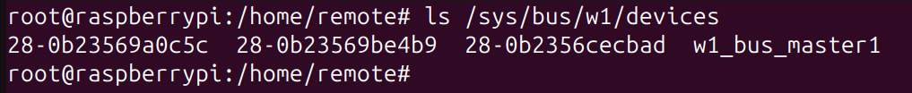

# Temperature-monitor
Ambient temperature measurement with RaspberyPI and DS18B20

The ribbon cable connects to the GPIO pins on the Pi. The DS18B20 has three wires. The red wire connects to 5V. 
The black wire connects to ground. The yellow wire connects to a pull-up resistor/pin 4. Once this is wired up, power on your Pi.

The latest version of Raspbian (kernel 3.18) requires an addition to your /boot/config.txt file for the Pi
to communicate with the DS18B20. Run the following to edit this file: 

    $ sudo nano /boot/config.txt

If the following line is not already in this file (if it is, it is likely at the bottom of the file), add it and save the file:

    dtoverlay=w1-gpio

Restart your Pi for the changes to take effect:

    $ sudo reboot

To start the temperature sensor read interface run commands:

    $ sudo modprobe w1-gpio
    $ sudo modprobe w1-therm

All devices will apear in the folowing directory:

    /sys/bus/w1/devices directory.

In this directory, there will be a sub-directories starts with “28-“. What comes after the “28-” is the serial number of the sensors. cd into one of that directories. Inside this directories, there will be w1_slave files contains the output of the sensor.

